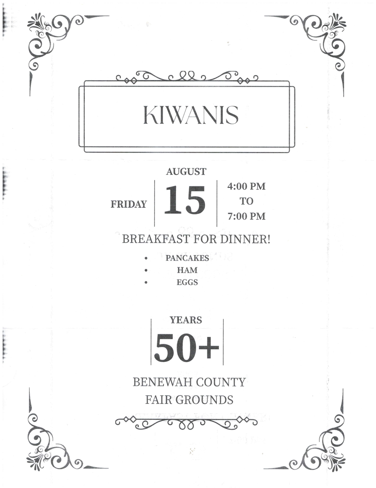

# Fair Schedule

Plan your visit using the official 2025 Benewah County Fair schedule. Times are subject to change; updates will be posted at the fair office and announcer stand.

**Check-ins August 11th-13th, Showing August 14th-16th**

=== "Monday, Aug 11th"
- 9:00 AM – 6:00 PM — Booth Set-up
- 4:00 PM – 7:00 PM — 4-H Indoor Project Interviews

=== "Tuesday, Aug 12th"
- 10:00 AM – 7:00 PM — Open Class Indoor Exhibit Check-in
- 4:00 PM – 7:00 PM — 4-H Indoor Project Interviews

=== "Wednesday, Aug 13th"
- NOTE: All fair buildings CLOSED for judging
- 7:00 AM – 12:00 PM — Enter all livestock exhibits
- 4:00 PM – 7:00 PM — Enter all livestock exhibits

=== "Thursday, Aug 14th"
- 8:00 AM – 8:30 AM — All Junior Show participants must meet with Judge
- 8:30 AM – 10:00 AM — Beef Quality
- 10:00 AM – 12:00 PM — Swine Fitting & Showing
- 12:00 PM — Break
- 1:00 PM – 3:30 PM — Poultry & Rabbit Fitting & Showing (quality judged in pen)
- 3:30 PM – 4:45 PM — Market Lamb Quality
- 4:45 PM – 5:45 PM — Market Goat Quality
- 5:45 PM – 6:30 PM — Horse Showmanship Finals
- 6:30 PM – 7:00 PM — PeeWee Swine Show (ages 5-8), pre-register with the barn superintendent before 12 PM

=== "Friday, Aug 15th"
- 8:00 AM – 9:30 AM — Beef Fitting & Showing
- 9:30 AM – 11:30 AM — Swine Quality
- 11:30 AM – 12:00 PM — Break
- 12:00 PM – 12:45 PM — Sheep Fitting & Showing
- Afternoon — Vendors on the lawn
- 12:45 PM – 1:30 PM — Goat Fitting & Showing, and Dairy Goat Quality
- 1:30 PM – 3:00 PM — Livestock Judging Contest
- 4:00 PM — Awards: ADG, All Around, Showmanship Buckles
- 4:00 PM – 7:00 PM — Kiwanis Breakfast for Dinner
- 4:30 PM – 6:30 PM — Round Robin
- Evening — Movie Night on the Big Screen

=== "Saturday, Aug 16th"
- 7:00 AM – 9:00 AM — Buyers’ Appreciation Breakfast
- All Day — Vendors on the lawn
- 8:00 AM – 9:30 AM — Dessert Contest Entries
- 9:00 AM — Livestock Auction
- 12:00 PM — Dessert Auction (immediately following livestock auction)
- 3:00 PM — Cow Patty Bingo
- 4:00 PM — 4-H Horse Exhibition
- 7:30 PM – 10:00 PM — Youth Barn Dance

=== "Sunday, Aug 17th"
- 9:00 AM — Check-out of all exhibits

## Event Flyers

> Images will appear after asset upload.

